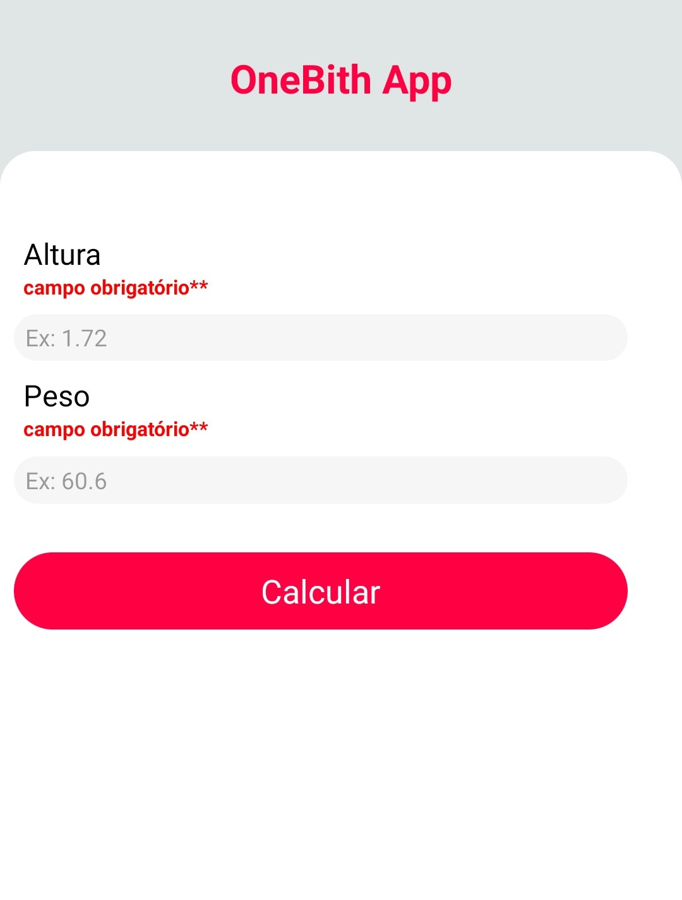
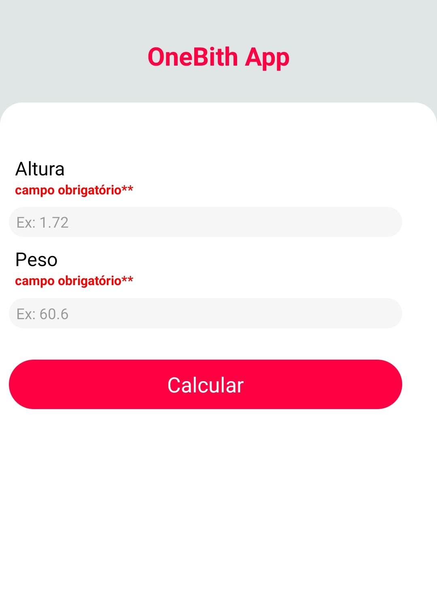
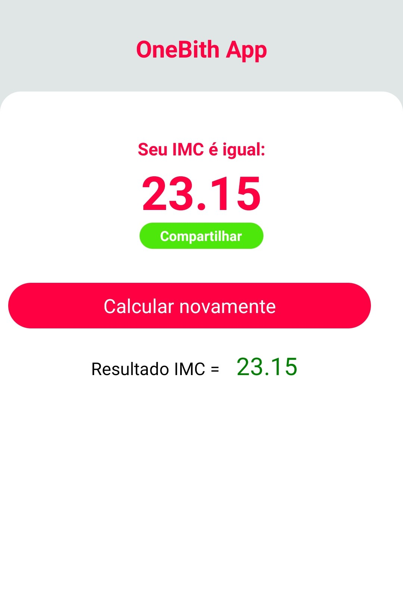
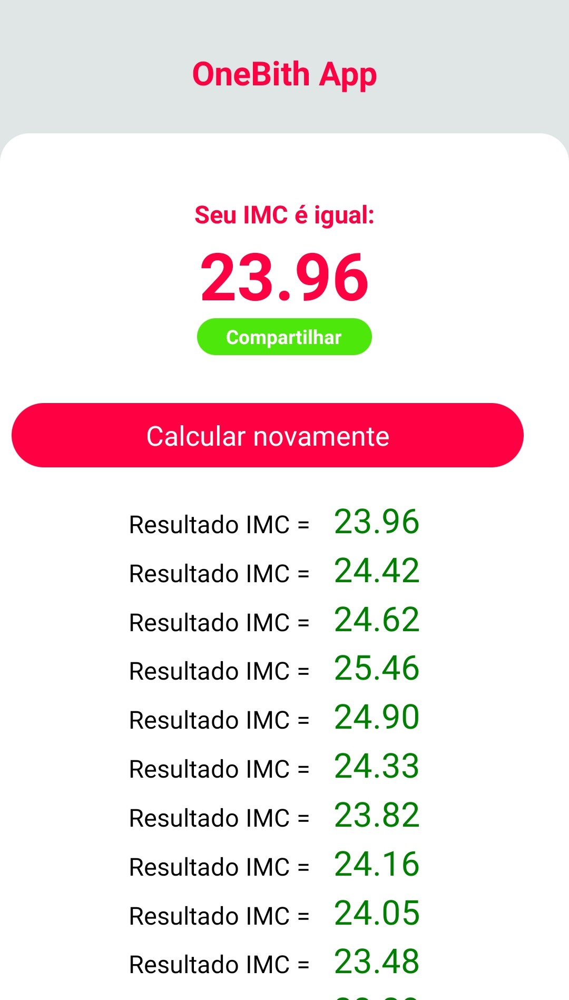

# oneBith

### Projeto de uma aplicação básica de cálculo de imc usando expo 
#### Aplicativo funcional desenvolvido no curso de React-Native do canal One Bit Code. O curso mostrou como iniciar um projeto de React-Native usando o expo. Conceitos adquiridos: Trabalhar com components e APIS...

